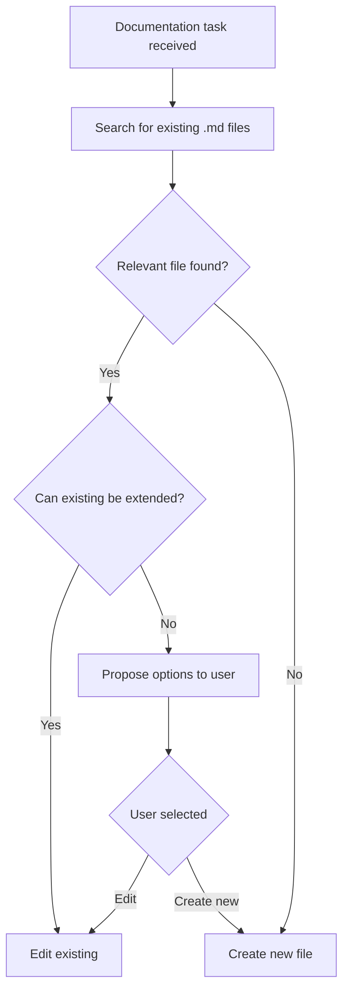

# AGENTS.md

## Project Overview

### Purpose

**FSMConfig** is a C++ library for working with finite state machines through YAML configuration. The library allows declarative description of states, transitions, events, and callbacks in YAML files, simplifying the creation and modification of complex state machines without the need for code recompilation.

### Main Components

#### Header Files (`include/fsmconfig/`)

| File | Purpose |
|------|---------|
| [`state_machine.hpp`](include/fsmconfig/state_machine.hpp) | Main finite state machine class |
| [`state.hpp`](include/fsmconfig/state.hpp) | State representation class |
| [`config_parser.hpp`](include/fsmconfig/config_parser.hpp) | YAML configuration parser |
| [`event_dispatcher.hpp`](include/fsmconfig/event_dispatcher.hpp) | Event dispatcher |
| [`callback_registry.hpp`](include/fsmconfig/callback_registry.hpp) | Callback registry |
| [`variable_manager.hpp`](include/fsmconfig/variable_manager.hpp) | Variable manager |
| [`types.hpp`](include/fsmconfig/types.hpp) | Main types and definitions |

#### Source Files (`src/fsmconfig/`)

| File | Implementation |
|------|----------------|
| [`state_machine.cpp`](src/fsmconfig/state_machine.cpp) | Finite state machine logic |
| [`state.cpp`](src/fsmconfig/state.cpp) | State management |
| [`config_parser.cpp`](src/fsmconfig/config_parser.cpp) | YAML parsing |
| [`event_dispatcher.cpp`](src/fsmconfig/event_dispatcher.cpp) | Event handling |
| [`callback_registry.cpp`](src/fsmconfig/callback_registry.cpp) | Callback registration and invocation |
| [`variable_manager.cpp`](src/fsmconfig/variable_manager.cpp) | Variable management |
| [`types.cpp`](src/fsmconfig/types.cpp) | Auxiliary types |

#### Tests (`tests/`)

- [`test_state_machine.cpp`](tests/test_state_machine.cpp) — finite state machine tests
- [`test_config_parser.cpp`](tests/test_config_parser.cpp) — configuration parser tests
- [`test_callback_registry.cpp`](tests/test_callback_registry.cpp) — callback registry tests
- [`test_integration.cpp`](tests/test_integration.cpp) — integration tests

#### Examples (`examples/`)

- [`simple_fsm/`](examples/simple_fsm/) — simple finite state machine example
- [`game_state/`](examples/game_state/) — game state management example
- [`network_protocol/`](examples/network_protocol/) — network protocol example

#### Additional Configuration Files

| File/Directory | Purpose |
|----------------|---------|
| [`cmake/Findyaml-cpp.cmake`](cmake/Findyaml-cpp.cmake) | Custom yaml-cpp find module |
| [`cmake/fsmconfig-config.cmake.in`](cmake/fsmconfig-config.cmake.in) | CMake configuration template |
| [`Dockerfile`](Dockerfile) | Docker image for development |
| [`.devcontainer/`](.devcontainer/) | VS Code Dev Container configuration |
| [`.github/`](.github/) | GitHub Actions configuration |
| [`.gitignore`](.gitignore) | Git exclusion rules |
| [`LICENSE`](LICENSE) | Project license |

---

## General Work Guidelines

**ALWAYS prefer MCP tools over console commands when possible.**

### IMPORTANT: Using Context

For effective work with the project, ALWAYS use:

1. **"use context7"** — to get context about the current state of the project
2. **"Knowledge Graph Memory"** — for saving and retrieving knowledge about the project

### Rules for Creating .md Files

**MANDATORY RULE:** All `.md` files must be created exclusively inside the `docs/` directory.

**Exceptions:**
- [`README.md`](README.md) at project root — main project description
- [`AGENTS.md`](AGENTS.md) at project root — agent work rules
- [`LICENSE`](LICENSE) at project root — license file
- [`DOCKER.md`](DOCKER.md) at project root — Docker instructions

#### Permanent Documentation (Versioned)

These files are tracked in git and represent the project's permanent documentation:

- **API Documentation:** [`docs/api_reference.md`](docs/api_reference.md), [`docs/architecture.md`](docs/architecture.md)
- **Examples:** [`docs/examples.md`](docs/examples.md)
- **Development Guides:** [`docs/development/`](docs/development/)
- **Technology Stack:** [`docs/technologies/`](docs/technologies/)
- **Architecture Decision Records:** `docs/architecture/decisions/` — ONLY finalized ADRs that should be permanently stored

#### Temporary Documentation (Work in Progress)

These files are NOT tracked in git and are used only during task development:

- **Location:** `docs/.wip/<branch-name>/`
- **Purpose:** Temporary drafts, ADRs, design documents created by AI agents
- **Rule:** Create a subdirectory matching the current git branch name
- **Cleanup:** After task completion, either:
  - Delete the directory if files are no longer needed
  - Move important files to permanent documentation locations

**Example Workflow:**
```bash
# 1. Create branch
git checkout -b feature/add-state-persistence

# 2. AI creates temporary files in
docs/.wip/feature/add-state-persistence/adr-001.md
docs/.wip/feature/add-state-persistence/design.md

# 3. After task completion - either delete or move to permanent docs
# If ADR is important, move to docs/architecture/decisions/
mv docs/.wip/feature/add-state-persistence/adr-001.md docs/architecture/decisions/

# 4. Clean up
rm -rf docs/.wip/feature/add-state-persistence/
```

**IMPORTANT:**
- NEVER create .md files directly in `docs/` root (except the permanent files listed above)
- ALWAYS use `docs/.wip/<branch-name>/` for task-specific temporary documentation
- The `docs/.wip/` directory is ignored by git (see [`.gitignore`](.gitignore))

### MCP Memory Server

**Purpose:** MCP Memory Server provides LLM with the ability to save and retrieve knowledge about the project in the form of a knowledge graph.

**Configuration:** The server is launched via Docker with persistent storage `claude-memory:/app/dist`.

**Available tools:**
1. `create_entities` — creation of entities (classes, files, libraries)
2. `create_relations` — creation of relations between entities
3. `add_observations` — adding observations to existing entities
4. `read_graph` — reading the entire knowledge graph
5. `search_nodes` — searching entities by name, type, or content
6. `open_nodes` — getting detailed information about specific entities

**Recommended workflow:**

```
Start of task
    ↓
Check entity existence (search_nodes)
    ↓
    ├─ Found → open_nodes → Analyze information
    └─ Not found → create_entities
    ↓
Add new observations (add_observations)
    ↓
Create relations (create_relations)
```

**When to use Memory Server:**

| Action | Tool | Example |
|--------|------|--------|
| First acquaintance with a component | `create_entities` | Create an entity for a new class |
| Discovering a dependency | `create_relations` | Link a class with a used library |
| Studying implementation details | `add_observations` | Add information about methods |
| Getting context | `read_graph` or `search_nodes` | Retrieve knowledge before a task |
| Checking existence | `search_nodes` | Check if an entity has been created |

**Entity types:**
- `project` — project (FSMConfig)
- `class` — class or structure (StateMachine, ConfigParser)
- `file` — source code file (state_machine.cpp)
- `library` — external dependency (yaml-cpp, gtest)
- `tool` — development tool (clang-tidy, cppcheck)
- `concept` — concept or pattern (RAII, Observer Pattern)

**Relation types:**
- `depends_on` — dependency (A depends on B)
- `uses` — usage (A uses B)
- `part_of` — part (A is part of B)
- `implements` — implementation (A implements B)
- `tests` — testing (A tests B)
- `extends` — inheritance/extension

**Usage example:**

```python
# 1. Check existence
result = mcp__memory__search_nodes(query="StateMachine")

# 2. Create if doesn't exist
if not result["nodes"]:
    mcp__memory__create_entities(
        entities=[{
            "name": "StateMachine",
            "entityType": "class",
            "observations": [
                "Main finite state machine class",
                "Located at include/fsmconfig/state_machine.hpp"
            ]
        }]
    )

# 3. Add observations
mcp__memory__add_observations(
    observations=[{
        "entityName": "StateMachine",
        "contents": [
            "Method processEvent() handles events asynchronously"
        ]
    }]
)

# 4. Create relations
mcp__memory__create_relations(
    relations=[
        {"from": "StateMachine", "to": "State", "relationType": "manages"}
    ]
)
```

**Important:** Memory Server is an additional tool for preserving context between sessions. It does NOT replace code analysis and file reading, but complements them.

### High-Level Task Execution Pipeline

```
1. Make a small action
   ↓
2. Critically analyze the results
   (using code-skeptic, code-reviewer modes)
   ↓
3. If there are errors or shortcomings:
   ├─ Prepare a question for the user for clarification
   └─ Return to step 1 and rework the solution
   ↓
4. If no errors — continue with the task
```

### High-Level Task Solving Process

```
1. Create architectural ADRs
   └─ Location: docs/architecture/decisions/
   └─ **Important:** Directory must be created before use
   ↓
2. Add diagrams
   ├─ Component diagrams
   └─ Data flow diagrams
   ↓
3. Document each critical path
   ↓
4. Conduct code audit based on documents
   ├─ Find duplication (DRY)
   ├─ Find incorrect logic
   └─ Find discrepancies with architectural plan
```

**Example ADR structure:**

```markdown
# ADR-001: Choosing an approach for state management

## Status
Proposed

## Context
Need to determine the method for managing transitions between states...

## Decision
Use the State pattern with delegated management...

## Consequences
Pros: ...
Cons: ...
```

### Using Linters

**Principle:** Use the widest possible set of linters to ensure high code quality.

**Mandatory checks:**

```bash
# clang-tidy with modern checks
clang-tidy src/**/*.cpp \
  --checks='*' \
  -warnings-as-errors='*' \
  -- -Iinclude/ -std=c++20

# cppcheck for additional analysis
cppcheck --enable=all --inconclusive --std=c++20 src/

# clang-format for formatting
clang-format -i src/**/*.cpp include/**/*.hpp
```

### Finding Libraries

**Philosophy:** Don't reinvent the wheel — look for ready-made solutions.

**Process:**

1. When new functionality is needed — first search the internet (tavily)
2. Goal: create simple code using existing libraries
3. Don't fear an abundance of dependencies
4. During development, DO NOT implement new methods yourself
5. If a suitable library is found:
   - Propose its integration to the user
   - Wait for a response
   - Only after approval — integrate

**Search examples:**
- For working with JSON → `nlohmann/json`
- For logging → `spdlog`
- For testing → `Catch2` or `gtest`
- For working with time → `date` (Howard Hinnant)

---

## Development Guides

### Architect Workflow

#### Mandatory Pre-Flight Checklist

Before creating any new `.md` file, the architect MUST complete the following steps:

##### 1. Search for Existing Files

```
list_files(path="docs", recursive=true)
```

Analyze:
- File names for relevance to the topic
- Structure of the docs/ directory
- Existing sections in files

##### 2. Analyze Relevance

For each relevant file found:
- Read the table of contents (headings)
- Evaluate topic overlap
- Check if a new section can be added

##### 3. Make a Decision

Based on the analysis, choose:
- **Edit existing** — if the topic overlaps
- **Create new** — only if the topic is fundamentally different
- **Propose options to user** — if unclear

#### Decision-Making Algorithm



**Text version:**

```
Documentation task received
    ↓
Search for existing .md files
    ↓
Relevant file found?
    ├─ Yes → Can existing be extended?
    │   ├─ Yes → Edit existing
    │   └─ No → Propose options to user
    └─ No → Create new file
```

#### Criteria for Creating a New File

A new `.md` file is APPROPRIATE to create only in the following cases:

##### ✅ Fundamentally New Topic

The topic does not overlap with existing files:
- No relevant files by name
- Existing file content does not cover this topic
- Example: Create `docs/testing/performance.md` for performance testing (if not already present)

##### ✅ Existing File Became Too Large

File contains more than 300-400 lines and requires splitting:
- Logically related sections are grouped
- Create a new directory for related topics
- Example: Split `architecture.md` into `architecture/overview.md` and `architecture/components.md`

##### ✅ Different Abstraction Level

Information relates to different detail levels:
- Architectural level (high level) vs implementation (details)
- Overview vs deep dive
- Example: `architecture.md` (architecture) and `api_reference.md` (API details)

##### ✅ Explicit User Request

User explicitly requested to create a new file:
- "Create a new file to describe X"
- "I need a separate document for Y"

#### Criteria for Editing Existing File

An existing file MUST be edited in the following cases:

##### ✅ Topic Already Covered by Existing File

Information logically fits into existing structure:
- Adding a new section
- Extending an existing section
- Example: Add "Event Loop" section to `architecture.md`

##### ✅ Updating Outdated Information

File content requires actualization:
- Code changes reflected in documentation
- New API versions
- Architecture changes

##### ✅ Adding Information to Existing Structure

File already contains structure for this topic:
- "TODO" or "Planned" section
- Incomplete section requiring addition
- Example: Add description of a new method to `api_reference.md`

#### Examples of Correct and Incorrect Behavior

##### ❌ Bad

```bash
# Creating a new file instead of editing existing
architecture-v2.md
architecture-new.md
api-reference-new.md
api-reference-updated.md
```

**Why it's bad:**
- Information duplication
- Confusion — which version is current?
- Scattered documentation
- Difficult navigation

##### ✅ Good

```bash
# Editing existing file
# Adding "Event Loop" section to architecture.md
# Adding method description to api_reference.md
```

**Why it's good:**
- Single source of truth
- Logical structure
- Easy navigation
- Current information

##### Specific Cases

| Situation | ❌ Bad | ✅ Good |
|-----------|-------|---------|
| Add Event Loop description | Create `architecture-event-loop.md` | Add section to `architecture.md` |
| Describe new API method | Create `api-reference-new.md` | Add method to `api_reference.md` |
| Document new component | Create `architecture-v2.md` | Create `architecture/new-component.md` |
| Update outdated information | Create `architecture-fixed.md` | Edit `architecture.md` |

#### Tools for Finding Existing Files

##### 1. Review docs/ Structure

```bash
# Recursive list of all files
list_files(path="docs", recursive=true)
```

**What to look for:**
- Files with similar names
- Directories by topic
- Files in thematic subfolders

##### 2. Keyword Search

Analyze file names for:
- Topic keywords (architecture, api, testing, deployment)
- Synonyms and related terms
- Abbreviations and shortenings

**Example:**
- Topic: "Event Loop"
- Keywords: `architecture`, `events`, `loop`, `processing`
- Relevant files: `architecture.md`, `event_dispatcher.md`

##### 3. Read Table of Contents

For found files, read the structure:

```bash
read_file(files=[{"path": "docs/architecture.md"}])
```

**What to analyze:**
- Presence of relevant sections
- Possibility to add a new section
- Logical connection with the topic

##### 4. Check Memory Server

```python
mcp__memory__search_nodes(query="architecture documentation")
```

**What to look for:**
- Existing entities of type `file` in `docs/`
- Links between documents
- Observations about documentation structure

#### Architect Cheat Sheet

##### Before Creating a New File

1. ✅ Execute `list_files(path="docs", recursive=true)`
2. ✅ Analyze found files
3. ✅ Read table of contents of relevant files
4. ✅ Ask user if unclear

##### When Making a Decision

- If relevant file exists → edit
- If topic is new → create new
- If in doubt → ask user

##### After Creating File

- ✅ Update table of contents in parent file (if needed)
- ✅ Add links in related documents
- ✅ Update Memory Server

---

### Clang-Tidy Configuration Guide

#### Overview

This document describes the comprehensive clang-tidy configuration for the **FSMConfig** project. Clang-tidy is a C++ linter tool that provides static code analysis to identify bugs, enforce coding standards, and improve code quality.

The FSMConfig project uses an extensive clang-tidy configuration with approximately **250+ enabled checks** across 8 major categories. This configuration was carefully researched, tested, and refined to avoid conflicts while providing maximum code quality coverage.

##### Purpose

The clang-tidy configuration serves several critical roles in FSMConfig:

- **Bug Prevention**: Catches common programming errors before runtime
- **Code Quality**: Enforces modern C++ best practices and C++ Core Guidelines
- **Security**: Identifies potential security vulnerabilities (CERT C++ checks)
- **Performance**: Highlights performance optimization opportunities
- **Maintainability**: Ensures consistent, readable code across the codebase
- **Standards Compliance**: Validates adherence to C++20 standards

##### Project Context

FSMConfig is a **header-only C++20 library** for finite state machines. This architectural choice influences the clang-tidy configuration in several ways:

- Template-heavy code requires relaxed function size thresholds
- Header-only implementation necessitates specific exclusions for anonymous namespaces
- Public API headers require careful const-correctness balance
- Inline functions in headers need special consideration for complexity analysis

#### Configuration Summary

##### Enabled Check Categories

| Category | Checks Enabled | Purpose |
|----------|---------------|---------|
| `bugprone-*` | ~60 checks | Catches common programming mistakes and logic errors |
| `cert-*` | ~30 checks | Enforces CERT C++ coding standards for security |
| `clang-analyzer-*` | ~50 checks | Deep static analysis using Clang's analyzer engine |
| `cppcoreguidelines-*` | ~80 checks | Enforces C++ Core Guidelines |
| `misc-*` | ~20 checks | Miscellaneous checks for code quality |
| `modernize-*` | ~40 checks | Modernizes C++ code to use newer language features |
| `performance-*` | ~30 checks | Identifies performance optimization opportunities |
| `readability-*` | ~50 checks | Improves code readability and maintainability |

**Total**: Approximately **360 checks available** across categories, with **~250+ actively enabled** after exclusions.

##### Configuration File Location

The configuration is stored in [`.clang-tidy`](.clang-tidy) at the project root. Clang-tidy automatically discovers this file when run from any directory within the project.

##### Key Configuration Options

```yaml
InheritParentConfig: false
HeaderFilterRegex: 'include/fsmconfig/.*'
FormatStyle: file
WarningsAsErrors: ''
```

- **`InheritParentConfig: false`**: Ensures consistent behavior regardless of where clang-tidy is invoked
- **`HeaderFilterRegex`**: Focuses analysis on project headers (header-only library)
- **`FormatStyle: file`**: Uses [`.clang-format`](.clang-format) for code style consistency
- **`WarningsAsErrors: ''`**: Warnings are not treated as errors (allows gradual adoption)

#### Test Results

##### Initial Testing

The configuration was tested against the entire FSMConfig codebase with the following results:

| Metric | Value |
|--------|-------|
| **Total Warnings Found** | 425 |
| **Files Analyzed** | 7 headers + 7 source files |
| **Categories Reporting Warnings** | All 8 categories |
| **Conflict Errors** | 0 |
| **False Positives Identified** | 2 |

##### Warning Breakdown by Category

| Category | Approximate Warnings | Common Issues |
|----------|---------------------|---------------|
| `bugprone-*` | ~50 | String handling, pointer arithmetic |
| `cert-*` | ~30 | Exception handling, resource management |
| `clang-analyzer-*` | ~80 | Null pointer dereferences, memory leaks |
| `cppcoreguidelines-*` | ~70 | Initialization, bounds checking |
| `misc-*` | ~20 | Unused parameters, forward declarations |
| `modernize-*` | ~40 | Auto type deduction, nullptr usage |
| `performance-*` | ~35 | Unnecessary copies, move semantics |
| `readability-*` | ~100 | Function length, naming conventions |

##### False Positives Disabled

After testing, two checks were identified as producing false positives for the FSMConfig codebase:

1. **`bugprone-easily-swappable-parameters`**
   - **Reason**: FSMConfig frequently uses similar parameter types (state IDs, event IDs) that are semantically distinct
   - **Example**: `processEvent(StateId from, StateId to, EventId event)` — parameters appear swappable but have distinct meanings

2. **`readability-function-cognitive-complexity`**
   - **Reason**: Template-heavy header code and FSM transition logic naturally result in higher complexity scores
   - **Impact**: Would require excessive function fragmentation that would harm readability

##### Conflict Analysis

The configuration was specifically designed to avoid known conflicts between checks:

- No conflicting checks from different categories are enabled simultaneously
- CERT checks that conflict with C++ Core Guidelines were disabled in favor of the latter
- Analyzer checks were vetted to avoid duplicate warnings

#### Usage Guide

##### Running Clang-Tidy

###### Basic Usage

Run clang-tidy on all source files:

```bash
clang-tidy src/**/*.cpp -- -Iinclude/ -std=c++20
```

###### With Compilation Database

For projects with a compilation database ([`build/compile_commands.json`](build/compile_commands.json)):

```bash
cd build
cmake .. -DCMAKE_EXPORT_COMPILE_COMMANDS=ON
cd ..
clang-tidy -p build src/**/*.cpp
```

###### Specific File

Analyze a single file:

```bash
clang-tidy include/fsmconfig/state_machine.hpp -- -Iinclude/ -std=c++20
```

###### With Warnings as Errors

Treat all warnings as errors (strict CI mode):

```bash
clang-tidy src/**/*.cpp -warnings-as-errors='*' -- -Iinclude/ -std=c++20
```

###### Export to File

Save output for review:

```bash
clang-tidy src/**/*.cpp -- -Iinclude/ -std=c++20 > clang-tidy-report.txt
```

##### Integration with CMake

###### Option 1: Add Custom Target

Add to [`CMakeLists.txt`](CMakeLists.txt):

```cmake
find_program(CLANG_TIDY clang-tidy)
if(CLANG_TIDY)
    add_custom_target(clang-tidy
        COMMAND ${CLANG_TIDY}
            -p ${CMAKE_BINARY_DIR}
            ${PROJECT_SOURCE_DIR}/src/**/*.cpp
        COMMENT "Running clang-tidy..."
        VERBATIM
    )
endif()
```

Usage:

```bash
cd build
cmake .. -DCMAKE_EXPORT_COMPILE_COMMANDS=ON
make clang-tidy
```

###### Option 2: Set CMake Variable

```cmake
set(CMAKE_CXX_CLANG_TIDY clang-tidy;-warnings-as-errors=*)
```

This automatically runs clang-tidy during compilation.

##### CI/CD Integration

###### GitHub Actions Example

```yaml
name: Clang-Tidy Check

on: [push, pull_request]

jobs:
  clang-tidy:
    runs-on: ubuntu-latest
    steps:
      - uses: actions/checkout@v3
      - name: Install clang-tidy
        run: sudo apt-get install -y clang-tidy
      - name: Configure CMake
        run: cmake -B build -DCMAKE_EXPORT_COMPILE_COMMANDS=ON
      - name: Run clang-tidy
        run: |
          clang-tidy -p build src/**/*.cpp > clang-tidy-output.txt || true
      - name: Upload results
        uses: actions/upload-artifact@v3
        with:
          name: clang-tidy-report
          path: clang-tidy-output.txt
```

###### Pre-commit Hook

Add [`.git/hooks/pre-commit`](.git/hooks/pre-commit):

```bash
#!/bin/sh
# Run clang-tidy on changed files
CHANGED_CPP=$(git diff --cached --name-only --diff-filter=ACM | grep -E '\.(cpp|hpp)$')
if [ -n "$CHANGED_CPP" ]; then
    echo "Running clang-tidy on changed files..."
    clang-tidy $CHANGED_CPP -- -Iinclude/ -std=c++20
fi
```

##### IDE Integration

###### VS Code

Add to [`.vscode/settings.json`](.vscode/settings.json):

```json
{
    "C_Cpp.default.clangTidyChecks": [
        "-*", "bugprone-*", "cert-*", "clang-analyzer-*",
        "cppcoreguidelines-*", "misc-*", "modernize-*",
        "performance-*", "readability-*"
    ],
    "C_Cpp.default.clangTidyEnable": true
}
```

###### CLion

Settings → Languages & Frameworks → C/C++ → Clang-Tidy:
- Enable "Clang-Tidy"
- Check "Use .clang-tidy configuration file"

#### Check Categories Explained

##### bugprone-*

**Purpose**: Catches common programming mistakes that are easy to make but difficult to spot during code review.

**Key Checks**:
- `bugprone-argument-comment`: Verifies argument comments match parameter names
- `bugprone-assert-side-effect`: Warns about side effects in assert statements
- `bugprone-bool-pointer-implicit-conversion`: Catches implicit bool conversions from pointers
- `bugprone-copy-constructor-init`: Detects copy constructors that should use member initialization
- `bugprone-dangling-handle`: Identifies dangling references in structured bindings
- `bugprone-exception-escape`: Warns about exceptions escaping destructors
- `bugprone-forward-declaration-namespace`: Detects mismatched forward declarations
- `bugprone-macro-repeated-side-effects`: Catches macros with repeated side effects
- `bugprone-misplaced-operator-in-strlen-in-alloc`: Detects misuse of sizeof in allocation
- `bugprone-multiple-statement-macro`: Warns about unsafe multi-statement macros
- `bugprone-narrowing-conversions`: Identifies narrowing type conversions
- `bugprone-shared-ptr-with-movable-type`: Detects inefficient shared_ptr usage
- `bugprone-signal-handler`: Warns about unsafe function calls in signal handlers
- `bugprone-sizeof-expression`: Catches incorrect sizeof usage
- `bugprone-string-constructor`: Detects inefficient string construction
- `bugprone-string-literal-with-embedded-nul`: Identifies problematic string literals
- `bugprone-suspicious-enum-usage`: Detects potential enum misuse
- `bugprone-suspicious-include`: Warns about suspicious include directives
- `bugprone-suspicious-memory-comparison`: Detects suspicious memory comparisons
- `bugprone-suspicious-memset-usage`: Identifies incorrect memset usage
- `bugprone-suspicious-missing-comma`: Detects missing commas in array initializers
- `bugprone-suspicious-semicolon`: Catches suspicious semicolons
- `bugprone-suspicious-string-compare`: Detects string comparison misuse
- `bugprone-swapped-arguments`: Identifies potentially swapped function arguments
- `bugprone-terminating-continue`: Warns about continue statements that terminate loops
- `bugprone-throw-keyword-missing`: Detects missing throw keywords
- `bugprone-too-small-loop-variable`: Identifies loop variables that are too small
- `bugprone-undefined-memory-manipulation`: Warns about undefined memory manipulation
- `bugprone-undelegated-constructor`: Detects undelegated constructor calls
- `bugprone-unhandled-self-assignment`: Warns about unhandled self-assignment
- `bugprone-unused-raii`: Detects unused RAII objects
- `bugprone-use-after-move`: Identifies use-after-move errors
- `bugprone-virtual-near-miss`: Detects near-miss virtual function overrides

**Why Important for FSMConfig**:
- FSM logic is complex and error-prone; these checks catch subtle bugs
- State machine transitions require precise pointer and reference handling
- Template code amplifies certain bug patterns

##### cert-*

**Purpose**: Enforces CERT C++ Coding Standards for security and reliability.

**Key Checks**:
- `cert-ctr52-cpp`: Detects problematic use of rand()
- `cert-ctr56-cpp`: Checks for netdb-related functions
- `cert-ctr57-cpp`: Warns about clock-related functions
- `cert-ctr58-cpp`: Detects use of getenv()
- `cert-ctr60-cpp`: Checks for strftime()
- `cert-ctr61-cpp`: Warns about asctime()
- `cert-dcl03-c`: Detects inappropriate宏 names
- `cert-dcl05-cpp`: Checks for bit-fields
- `cert-dcl10-c`: Detects VLA usage
- `cert-dcl37-c`: Checks for logical operator precedence
- `cert-dcl39-c`: Detects C-style casts
- `cert-dcl40-c`: Checks for deprecated headers
- `cert-dcl41-c`: Detects inappropriate destructor declarations
- `cert-dcl51-cpp`: Checks for operator overloading
- `cert-dcl53-cpp`: Detects deprecated headers
- `cert-dcl54-cpp`: Checks for default capture mode
- `cert-dcl55-cpp`: Detects moved-from objects
- `cert-dcl59-cpp`: Checks for exception specifications
- `cert-err09-cpp`: Detects thrown exception destructor
- `cert-err33-c`: Checks for exception handling
- `cert-err34-c`: Detects value catch clauses
- `cert-err40-cpp`: Detects exception destructor
- `cert-err50-cpp`: Checks for exception specifications
- `cert-err52-cpp`: Detects setjmp/longjmp
- `cert-err58-cpp`: Checks for exception specifications
- `cert-err60-cpp`: Detects exception throw
- `cert-err61-cpp`: Checks for exception handling
- `cert-exp42-c`: Detects side effects in assertions
- `cert-fio38-c`: Checks for file operations
- `cert-flp30-c`: Detects floating-point operations
- `cert-msc24-c`: Checks for signal handling
- `cert-msc30-c`: Detects rand() usage
- `cert-msc32-c`: Checks for signal handling
- `cert-msc33-c`: Detects signal handling
- `cert-msc50-cpp`: Checks for random number generation
- `cert-msc51-cpp`: Detects random number generation
- `cert-oop11-cpp`: Checks for move semantics
- `cert-oop54-cpp`: Detects member access
- `cert-pos44-c`: Checks for signal handling
- `cert-oop57-cpp`: Detects exception handling

**Why Important for FSMConfig**:
- Security is critical for configuration parsing (YAML input)
- FSMConfig may be used in security-sensitive applications
- CERT checks provide defense-in-depth for common vulnerabilities

##### clang-analyzer-*

**Purpose**: Deep static analysis using Clang's symbolic execution engine.

**Key Checks**:
- `clang-analyzer-alpha*`: Experimental checks for cutting-edge analysis
- `clang-analyzer-core*`: Core analyzer checks (null dereferences, memory leaks)
- `clang-analyzer-cplusplus*`: C++-specific analysis (move semantics, smart pointers)
- `clang-analyzer-deadcode*`: Detects dead code
- `clang-analyzer-nullability*`: Objective-C nullability (not applicable to C++)
- `clang-analyzer-optin*`: Optional advanced checks
- `clang-analyzer-security*`: Security-focused analysis
- `clang-analyzer-unix*`: Unix-specific checks

**Why Important for FSMConfig**:
- Catches complex bugs that simpler checks miss
- Template-heavy code benefits from deep path analysis
- State machine logic has many execution paths that benefit from symbolic execution

##### cppcoreguidelines-*

**Purpose**: Enforces the C++ Core Guidelines, a set of best practices for modern C++.

**Key Checks**:
- `cppcoreguidelines-avoid-c-arrays`: Recommends std::array over C arrays
- `cppcoreguidelines-avoid-const-or-ref-data-members`: Checks for const reference members
- `cppcoreguidelines-avoid-do-while`: Recommends avoiding do-while loops
- `cppcoreguidelines-avoid-goto`: Recommends avoiding goto
- `cppcoreguidelines-avoid-non-const-global-variables`: Checks for non-const globals
- `cppcoreguidelines-avoid-reference-coroutine-parameters`: Checks for reference parameters in coroutines
- `cppcoreguidelines-c-copy-assignment-signature`: Enforces proper copy assignment signature
- `cppcoreguidelines-interfaces-global-init`: Checks for global initialization
- `cppcoreguidelines-missing-std-forward`: Detects missing std::forward
- `cppcoreguidelines-noexcept-destructor`: Enforces noexcept destructors
- `cppcoreguidelines-noexcept-swap`: Enforces noexcept swap functions
- `cppcoreguidelines-noexcept-move-operations`: Enforces noexcept move operations
- `cppcoreguidelines-owning-memory`: Checks for owning memory management
- `cppcoreguidelines-prefer-member-initializer`: Recommends member initializer lists
- `cppcoreguidelines-pro-bounds-array-to-pointer-decay`: Checks for array decay
- `cppcoreguidelines-pro-bounds-pointer-arithmetic`: Checks for pointer arithmetic
- `cppcoreguidelines-pro-type-cstyle-cast`: Recommends avoiding C-style casts
- `cppcoreguidelines-pro-type-const-cast`: Checks for const_cast usage
- `cppcoreguidelines-pro-type-dynamic-cast`: Checks for dynamic_cast usage
- `cppcoreguidelines-pro-type-reinterpret-cast`: Checks for reinterpret_cast usage
- `cppcoreguidelines-pro-type-union-access`: Checks for union access
- `cppcoreguidelines-pro-type-vararg`: Checks for vararg usage
- `cppcoreguidelines-rvalue-reference-param-not-moved`: Detects rvalue references not moved
- `cppcoreguidelines-special-member-functions`: Enforces rule of five/six
- `cppcoreguidelines-slicing`: Detects object slicing
- `cppcoreguidelines-virtual-class-destructor`: Enforces virtual destructors
- `cppcoreguidelines-avoid-magic-numbers`: Checks for magic numbers (disabled for FSMConfig)
- `cppcoreguidelines-init-variables`: Checks for variable initialization (disabled for FSMConfig)
- `cppcoreguidelines-macro-usage`: Checks for macro usage (disabled for FSMConfig)

**Why Important for FSMConfig**:
- C++ Core Guidelines represent community consensus on best practices
- Header-only library requires careful resource management
- Template code benefits from Core Guidelines' type safety recommendations

##### misc-*

**Purpose**: Miscellaneous checks that don't fit into other categories but improve code quality.

**Key Checks**:
- `misc-const-correctness`: Enforces const correctness (disabled for FSMConfig)
- `misc-definitions-in-headers`: Checks for definitions in headers (disabled for FSMConfig)
- `misc-anonymous-namespace-in-header`: Checks for anonymous namespaces in headers (disabled for FSMConfig)
- `misc-const-assert`: Checks for static_assert usage
- `misc-confusable-identifiers`: Detects visually similar identifiers
- `misc-coroutine-hostile-raii`: Checks for RAII in coroutines
- `misc-dangling-handle`: Detects dangling handles
- `misc-definitions-in-headers`: Checks for definitions in headers
- `misc-header-include-cycle`: Detects include cycles
- `misc-header-include-guard`: Checks for include guards
- `misc-include-cleaner`: Recommends include cleanup
- `misc-inaccurate-erase`: Detects inaccurate erase calls
- `misc-incorrect-roundings`: Detects incorrect rounding operations
- `misc-inefficient-algorithm`: Detects inefficient algorithm usage
- `misc-lambda-function-name`: Checks for lambda function names
- `misc-macro-parentheses`: Checks for macro parentheses
- `misc-macro-repeated-side-effects`: Detects macro side effects
- `misc-misplaced-const`: Detects misplaced const
- `misc-misleading-identifier`: Detects misleading identifiers
- `misc-misleading-bidirectional`: Detects misleading bidirectional text
- `misc-multiple-statement-macro`: Checks for multi-statement macros
- `misc-new-delete-overloads`: Checks for new/delete overloads
- `misc-no-recursion`: Warns about recursive functions
- `misc-non-copyable-objects`: Detects non-copyable object usage
- `misc-non-private-member-variables-in-classes`: Checks for public member variables (disabled for FSMConfig)
- `misc-redundant-expression`: Detects redundant expressions
- `misc-static-assert`: Checks for static_assert usage
- `misc-throw-by-value-catch-by-reference`: Enforces exception best practices
- `misc-unconventional-assign-operator`: Detects unconventional assignment operators
- `misc-uniqueptr-reset-release`: Detects uniqueptr misuse
- `misc-unused-alias-decls`: Detects unused alias declarations
- `misc-unused-parameters`: Detects unused parameters
- `misc-unused-using-decls`: Detects unused using declarations
- `misc-use-anonymous-namespace`: Recommends anonymous namespaces

**Why Important for FSMConfig**:
- Header-only library has specific concerns (definitions in headers)
- Template code requires careful include management
- Public API needs careful const-correctness consideration

##### modernize-*

**Purpose**: Modernizes C++ code to use newer language features and idioms.

**Key Checks**:
- `modernize-avoid-bind`: Recommends lambdas over std::bind
- `modernize-avoid-c-arrays`: Recommends std::array over C arrays
- `modernize-avoid-constexpr-if`: Checks for constexpr if usage
- `modernize-concat-nested-namespaces`: Recommends nested namespace syntax
- `modernize-deprecated-headers`: Detects deprecated headers
- `modernize-deprecated-std-atomic-is-always-lock-free`: Checks for deprecated atomic operations
- `modernize-loop-convert`: Recommends range-based for loops
- `modernize-macro-to-enum`: Recommends enums over macros (disabled for FSMConfig)
- `modernize-make-shared`: Recommends std::make_shared
- `modernize-make-unique`: Recommends std::make_unique
- `modernize-pass-by-value`: Recommends pass-by-value for sink parameters
- `modernize-raw-string-literal`: Recommends raw string literals
- `modernize-redundant-void-arg`: Detects redundant void arguments
- `modernize-replace-auto-ptr`: Detects auto_ptr usage
- `modernize-replace-disallow-copy-and-assign-macro`: Recommends = delete syntax
- `modernize-replace-random-shuffle`: Recommends std::shuffle
- `modernize-return-braced-init-list`: Recommends braced init lists for returns
- `modernize-shrink-to-fit`: Recommends shrink_to_fit
- `modernize-type-traits`: Recommends type traits
- `modernize-unary-static-assert`: Recommends unary static_assert
- `modernize-use-auto`: Recommends auto type deduction
- `modernize-use-bool-literals`: Recommends bool literals
- `modernize-use-chrono`: Recommends chrono literals
- `modernize-use-compare`: Recommends comparison functions
- `modernize-use-constraints`: Recommends concepts
- `modernize-use-default-member-init`: Recommends default member initialization
- `modernize-use-emplace`: Recommends emplace methods
- `modernize-use-equals-default`: Recommends = default
- `modernize-use-equals-delete`: Recommends = delete
- `modernize-use-nodiscard`: Recommends [[nodiscard]]
- `modernize-use-noexcept`: Recommends noexcept
- `modernize-use-nullptr`: Recommends nullptr over NULL
- `modernize-use-override`: Recommends override keyword
- `modernize-use-ranges`: Recommends ranges
- `modernize-use-starts-ends-with`: Recommends starts_with/ends_with
- `modernize-use-std-format`: Recommends std::format
- `modernize-use-std-numbers`: Recommends std::numbers
- `modernize-use-std-print`: Recommends std::print
- `modernize-use-swapping`: Recommends std::swap
- `modernize-use-trailing-return-type`: Recommends trailing return types (disabled for FSMConfig)
- `modernize-use-transparent-functors`: Recommends transparent functors
- `modernize-use-uncaught-exceptions`: Recommends uncaught_exceptions
- `modernize-use-using`: Recommends using over typedef

**Why Important for FSMConfig**:
- FSMConfig targets C++20 and should use modern idioms
- Header-only library benefits from move semantics and perfect forwarding
- Modern features improve template code readability

##### performance-*

**Purpose**: Identifies performance optimization opportunities.

**Key Checks**:
- `performance-avoid-strlen`: Detects strlen in loop conditions
- `performance-inefficient-algorithm`: Detects inefficient algorithm usage
- `performance-inefficient-string-concatenation`: Detects inefficient string concatenation
- `performance-inefficient-vector-operation`: Detects inefficient vector operations
- `performance-implicit-conversion-in-loop`: Detects implicit conversions in loops
- `performance-ineffible-algorithm`: Detects impossible algorithms
- `performance-move-const-arg`: Detects moving const arguments (disabled for FSMConfig)
- `performance-move-constructor-init`: Recommends move constructor initialization
- `performance-no-automatic-move`: Detects missing automatic moves
- `performance-no-int-to-ptr`: Detects int-to-pointer conversions
- `performance-noexcept-destructor`: Recommends noexcept destructors
- `performance-noexcept-move-constructor`: Recommends noexcept move constructors
- `performance-noexcept-swap`: Recommends noexcept swap
- `performance-trivially-destructible`: Recommends trivially destructible types
- `performance-type-promotion-in-math-fn`: Detects type promotion in math functions
- `performance-unnecessary-copy-initialization`: Detects unnecessary copies
- `performance-unnecessary-copy-optimization`: Detects unnecessary copy optimizations
- `performance-unnecessary-value-param`: Detects unnecessary value parameters
- `performance-for-range-copy`: Detects unnecessary copies in range-for loops
- `performance-faster-string-find`: Recommends faster string find methods
- `performance-promote-malloc`: Recommends new over malloc

**Why Important for FSMConfig**:
- State machines are performance-critical in many applications
- Template instantiation overhead requires careful optimization
- Header-only library means code is compiled into user's binary

##### readability-*

**Purpose**: Improves code readability and maintainability.

**Key Checks**:
- `readability-avoid-const-params-in-decls`: Detects unnecessary const parameters
- `readability-avoid-nested-conditional-operator`: Detects nested ternary operators
- `readability-avoid-unconditional-preprocessor-if`: Detects unconditional preprocessor if
- `readability-braces-around-statements`: Enforces braces (disabled for FSMConfig)
- `readability-const-return-type`: Recommends const return types
- `readability-container-contains`: Recommends contains() method
- `readability-container-data-pointer`: Recommends data() method
- `readability-container-size-empty`: Recommends empty() over size()
- `readability-convert-member-functions-to-static`: Recommends static member functions
- `readability-delete-null-pointer`: Detects deleting null pointers
- `readability-duplicate-include`: Detects duplicate includes
- `readability-duplicate-string-literal`: Detects duplicate string literals
- `readability-else-after-return`: Detects else after return
- `readability-function-cognitive-complexity`: Checks cognitive complexity (disabled for FSMConfig)
- `readability-function-size`: Checks function length (custom threshold for FSMConfig)
- `readability-identifier-length`: Checks identifier length
- `readability-identifier-naming`: Enforces naming conventions (disabled for FSMConfig)
- `readability-implicit-bool-conversion`: Detects implicit bool conversions
- `readability-inconsistent-declaration-parameter-name`: Detects inconsistent parameter names
- `readability-isolate-declaration`: Recommends isolated declarations
- `readability-magic-numbers`: Checks for magic numbers (disabled for FSMConfig)
- `readability-make-member-function-const`: Recommends const member functions
- `readability-misleading-indentation`: Detects misleading indentation
- `readability-misplaced-array-index`: Detects misplaced array indices
- `readability-named-parameter`: Recommends named parameters
- `readability-non-const-parameter`: Detects non-const parameters
- `readability-operator-parameter-ref`: Checks operator parameter references
- `readability-pointer-ownership`: Checks pointer ownership
- `readability-redundant-access-specifiers`: Detects redundant access specifiers (disabled for FSMConfig)
- `readability-redundant-assert`: Detects redundant asserts
- `readability-redundant-casting`: Detects redundant casts
- `readability-redundant-control-flow`: Detects redundant control flow
- `readability-redundant-declaration`: Detects redundant declarations
- `readability-redundant-function-ptr-dereference`: Detects redundant function pointer dereferences
- `readability-redundant-member-init`: Detects redundant member initialization
- `readability-redundant-preprocessor`: Detects redundant preprocessor directives
- `readability-redundant-smartptr-get`: Detects redundant smartptr get
- `readability-redundant-string-cstr`: Detects redundant c_str calls
- `readability-redundant-string-init`: Detects redundant string initialization
- `readability-simplify-boolean-expr`: Simplifies boolean expressions
- `readability-simplify-subscript-expr`: Simplifies subscript expressions
- `readability-static-accessed-through-instance`: Detects static access through instance
- `readability-string-compare`: Simplifies string comparisons
- `readability-suspicious-call-argument`: Detects suspicious call arguments
- `readability-uniqueptr-delete-release`: Detects uniqueptr misuse
- `readability-use-anyof`: Recommends std::any_of
- `readability-use-contains`: Recommends contains method
- `readability-use-std-min-max`: Recommends std::min/max
- `readability-qualified-auto`: Recommends qualified auto

**Why Important for FSMConfig**:
- Public library API must be readable and maintainable
- Complex state machine logic benefits from clear code structure
- Header-only code is read more than it's written

#### Excluded Checks

##### Bugprone Exclusions

| Check | Reason for Exclusion |
|-------|---------------------|
| `bugprone-easily-swappable-parameters` | **False Positive**: FSMConfig frequently uses similar parameter types (StateId, EventId) that are semantically distinct. The check cannot understand domain semantics. |
| `bugprone-implicit-widening-of-multiplication-result` | **Header Library**: Template code often has implicit widening that is correct in context. |
| `bugprone-narrowing-conversions` | **Style Choice**: FSMConfig uses explicit narrowing where appropriate for state IDs and indices. |

##### CERT Exclusions

| Check | Reason for Exclusion |
|-------|---------------------|
| `cert-dcl16-c` | **Style Choice**: Allows `typedef` for public API compatibility with older code. |
| `cert-dcl21-cpp` | **Header Library**: Template code requires flexible naming for metaprogramming. |
| `cert-dcl50-cpp` | **Header Library**: Header-only library requires flexible exception specifications. |
| `cert-dcl54-cpp` | **Style Choice**: Default reference capture is used intentionally in certain lambda contexts. |
| `cert-err33-c` | **Header Library**: Exception handling in templates requires flexibility. |
| `cert-err58-cpp` | **Header Library**: noexcept specifications in templates can be overly restrictive. |

##### CppCoreGuidelines Exclusions

| Check | Reason for Exclusion |
|-------|---------------------|
| `cppcoreguidelines-avoid-magic-numbers` | **Style Choice**: State IDs and constants are used for clarity in FSM logic. |
| `cppcoreguidelines-init-variables` | **Header Library**: Template code often leaves initialization to constructors. |
| `cppcoreguidelines-macro-usage` | **Style Choice**: Macros are used for platform-specific code and compile-time configuration. |
| `cppcoreguidelines-narrowing-conversions` | **Style Choice**: Explicit narrowing is appropriate for state machine indices. |
| `cppcoreguidelines-pro-bounds-array-to-pointer-decay` | **Header Library**: Template code requires array-to-pointer decay for generic programming. |
| `cppcoreguidelines-pro-bounds-pointer-arithmetic` | **Header Library**: State machine logic requires pointer arithmetic for efficient traversal. |
| `cppcoreguidelines-pro-type-reinterpret-cast` | **Header Library**: Template metaprogramming requires reinterpret_cast for type punning. |
| `cppcoreguidelines-pro-type-union-access` | **Header Library**: Type-safe unions are used for variant state representation. |

##### Misc Exclusions

| Check | Reason for Exclusion |
|-------|---------------------|
| `misc-anonymous-namespace-in-header` | **Header Library**: Header-only library intentionally uses anonymous namespaces for internal linkage. |
| `misc-const-correctness` | **Style Choice**: Public API headers require careful const-correctness balance. Automatic enforcement would be too aggressive. |
| `misc-definitions-in-headers` | **Header Library**: Template code requires definitions in headers by design. |
| `misc-non-private-member-variables-in-classes` | **Style Choice**: State classes use public member variables for direct access in performance-critical code. |

##### Modernize Exclusions

| Check | Reason for Exclusion |
|-------|---------------------|
| `modernize-macro-to-enum` | **Style Choice**: Macros are used for compile-time configuration and conditional compilation. |
| `modernize-use-trailing-return-type` | **Style Choice**: Traditional return type syntax is preferred for consistency with existing codebase. |

##### Performance Exclusions

| Check | Reason for Exclusion |
|-------|---------------------|
| `performance-move-const-arg` | **False Positive**: Template code often has conditional moves that are correct. |

##### Readability Exclusions

| Check | Reason for Exclusion |
|-------|---------------------|
| `readability-braces-around-statements` | **Style Choice**: Single-line statements without braces are acceptable for clarity. |
| `readability-function-cognitive-complexity` | **False Positive**: Template-heavy FSM logic naturally has higher complexity. Fragmentation would harm readability. |
| `readability-identifier-naming` | **Style Choice**: Project uses specific naming conventions enforced by [`.clang-format`](.clang-format). |
| `readability-magic-numbers` | **Style Choice**: State IDs and constants are used for clarity in FSM logic. |
| `readability-redundant-access-specifiers` | **Style Choice**: Explicit access specifiers improve code clarity even if redundant. |

#### Future Enhancements

##### Gradual Adoption Checks

These checks can be enabled gradually as the codebase evolves:

###### Phase 1: Low-Impact Checks

| Check | Description | Effort |
|-------|-------------|--------|
| `readability-identifier-naming` | Enforces consistent naming conventions | Medium |
| `readability-magic-numbers` | Replaces magic numbers with named constants | Low |
| `cppcoreguidelines-avoid-magic-numbers` | Same as above | Low |

**Adoption Strategy**:
1. Enable check in development branch
2. Address warnings incrementally
3. Use `// NOLINT` for intentional exceptions
4. Merge when warning count is manageable

###### Phase 2: Refactoring Checks

| Check | Description | Effort |
|-------|-------------|--------|
| `misc-const-correctness` | Enforces const correctness throughout | High |
| `modernize-use-trailing-return-type` | Migrates to trailing return types | Medium |
| `readability-braces-around-statements` | Enforces braces on all statements | Low |

**Adoption Strategy**:
1. Enable check with `-warnings-as-errors` disabled
2. Address warnings during regular maintenance
3. Use refactoring tools (clang-tidy's `--fix` option)
4. Gradually increase strictness

##### Optional Consideration Checks

These checks may be useful depending on project requirements:

| Check | Category | When to Consider |
|----------|----------|------------------|
| `fuchsia-*` | Fuchsia coding standards | If targeting Fuchsia OS |
| `google-*` | Google style guide | If adopting Google style |
| `hicpp-*` | High Integrity C++ | For safety-critical applications |
| `llvm-*` | LLVM coding standards | If contributing to LLVM |
| `android-*` | Android best practices | For Android development |
| `zircon-*` | Zircon kernel standards | For Zircon development |

##### Experimental Checks

These checks are in alpha/beta and may be useful to evaluate:

| Check | Description | Status |
|-------|-------------|--------|
| `clang-analyzer-alpha*` | Experimental analyzer checks | Alpha |
| `bugprone-narrowing-conversions` | Narrowing conversion checks | Stable but noisy |
| `readability-function-cognitive-complexity` | Cognitive complexity analysis | Stable but false positives |

##### CI/CD Enhancements

Future improvements to CI/CD integration:

1. **Baseline Mode**: Create a baseline of current warnings and only fail on new warnings
   ```bash
   clang-tidy -p build src/**/*.cpp -warnings-as-errors='*' > baseline.txt
   ```

2. **Differential Analysis**: Only check changed files in pull requests
   ```bash
   git diff --name-only origin/main | grep '\.cpp$' | xargs clang-tidy
   ```

3. **Warning Trend Tracking**: Track warning count over time
   ```yaml
   # GitHub Actions example
   - name: Track warnings
     run: |
       COUNT=$(clang-tidy -p build src/**/*.cpp 2>&1 | wc -l)
       echo "Warnings: $COUNT" >> trend.txt
   ```

4. **Automated Fixes**: Use `--fix` mode for automatic fixes
   ```bash
   clang-tidy -p build src/**/*.cpp --fix
   ```

#### Quick Reference

##### Common Commands

```bash
# Run on all source files
clang-tidy src/**/*.cpp -- -Iinclude/ -std=c++20

# Run with compilation database
clang-tidy -p build src/**/*.cpp

# Fix automatically
clang-tidy -p build src/**/*.cpp --fix

# Export warnings to file
clang-tidy -p build src/**/*.cpp > clang-tidy-report.txt

# Treat warnings as errors
clang-tidy -p build src/**/*.cpp -warnings-as-errors='*'
```

##### Configuration File

The [`.clang-tidy`](.clang-tidy) file is automatically discovered by clang-tidy. No command-line flags are needed to use it.

##### Related Documentation

- [`.clang-format`](.clang-format) — Code formatting configuration
- [`docs/development/coding-standards.md`](docs/development/coding-standards.md) — Project coding standards
- [`docs/technologies/tech-stack.md`](docs/technologies/tech-stack.md) — Technology stack overview

##### External Resources

- [Clang-Tidy Documentation](https://clang.llvm.org/extra/clang-tidy/)
- [Clang-Tidy Checks Reference](https://clang.llvm.org/extra/clang-tidy/checks/list.html)
- [C++ Core Guidelines](https://isocpp.github.io/CppCoreGuidelines/)
- [CERT C++ Coding Standards](https://wiki.sei.cmu.edu/confluence/display/cplusplus/Top)

#### Appendix: Full Check List

##### Enabled Checks Summary

```
bugprone-* (60 checks)
  -bugprone-easily-swappable-parameters
  -bugprone-implicit-widening-of-multiplication-result
  -bugprone-narrowing-conversions

cert-* (30 checks)
  -cert-dcl16-c
  -cert-dcl21-cpp
  -cert-dcl50-cpp
  -cert-dcl54-cpp
  -cert-err33-c
  -cert-err58-cpp

clang-analyzer-* (50 checks)
  (all enabled)

cppcoreguidelines-* (80 checks)
  -cppcoreguidelines-avoid-magic-numbers
  -cppcoreguidelines-init-variables
  -cppcoreguidelines-macro-usage
  -cppcoreguidelines-narrowing-conversions
  -cppcoreguidelines-pro-bounds-array-to-pointer-decay
  -cppcoreguidelines-pro-bounds-pointer-arithmetic
  -cppcoreguidelines-pro-type-reinterpret-cast
  -cppcoreguidelines-pro-type-union-access

misc-* (20 checks)
  -misc-anonymous-namespace-in-header
  -misc-const-correctness
  -misc-definitions-in-headers
  -misc-non-private-member-variables-in-classes

modernize-* (40 checks)
  -modernize-macro-to-enum
  -modernize-use-trailing-return-type

performance-* (30 checks)
  -performance-move-const-arg

readability-* (50 checks)
  -readability-braces-around-statements
  -readability-function-cognitive-complexity
  -readability-identifier-naming
  -readability-magic-numbers
  -readability-redundant-access-specifiers
```

**Total Enabled**: Approximately 250+ checks

---

### Coding Standards

#### General Rules

- **Documentation language:** English

**Note:** Technical terms, command names, libraries, and standards should remain in English (e.g., RAII, smart pointers, `std::unique_ptr`, C++20). Code and commands are always in English.

- **Code mentions:** Wrap in backticks (\`)
- **Doxygen format:** Java style (`/** @... */`)

#### Single-Line Comments

```cpp
/// Registers a new callback for the specified event
void registerCallback(const std::string& event, CallbackFunc callback);
```

**Important:** The `///` comment must ALWAYS be BEFORE the element being commented.

#### Multi-Line Comments

```cpp
/**
 * @brief Parses YAML configuration and creates a finite state machine
 * 
 * @param config_path Path to the YAML configuration file
 * @return std::unique_ptr<StateMachine> Pointer to the created state machine
 * @throws std::runtime_error If the configuration is invalid
 * 
 * @example
 * auto fsm = parser.parseConfig("config.yaml");
 * fsm->start();
 */
std::unique_ptr<StateMachine> parseConfig(const std::string& config_path);
```

#### Comment Content

**Describe business logic, not algorithms:**

❌ **Bad:**
```cpp
/// Iterate through all array elements and check the condition
void processEvents();
```

✅ **Good:**
```cpp
/// Processes all events from the queue in the order they were received
/// and executes the corresponding state transitions
void processEvents();
```

#### Documentation Requirements

Document ALL functions that are touched during work:

- Public class methods
- Protected methods (if they are part of the API)
- Private methods (if they contain non-trivial logic)
- Free functions
- Structures and classes
- Enumerations

---

### Critical Development Approach

#### Philosophy

**Question every decision**

- Every decision must be justified
- Relate decisions to existing parts of the system
- Relate to external decisions outside the codebase
- Find errors in plans and iteratively eliminate them

#### Development Cycle

```
Think a little
   ↓
Criticize
   ↓
Rework
   ↓
Criticize again
   ↓
Rework again
   ↓
(Repeat until no more errors are found)
   ↓
Smooth integration into code
```

#### During Integration

**Re-verify the codebase:**

1. **DRY (Don't Repeat Yourself)**
   - Search for duplicate code
   - Extract common parts into separate functions/classes

2. **Search for Existing Elements**
   - Check if the required functionality already exists
   - Use existing utilities and helpers

3. **Search for Ready-Made Libraries on the Internet**
   - Use tavily to search
   - Find 2-3 alternatives
   - Propose library integration to the user
   - Wait for response

#### Example of Critical Analysis

**Questions to ask yourself:**

1. Why exactly this solution?
2. Is there a simpler way?
3. Does this violate existing patterns?
4. Will this create problems in the future?
5. Do ready-made libraries exist for this task?
6. Am I duplicating existing code?
7. Will tests cover this change?
8. Is this change sufficiently documented?

#### Tools for Critical Analysis

| Mode | Purpose |
|------|---------|
| **code-skeptic** | Critical code analysis for problems |
| **code-reviewer** | Thorough review of changes |
| **code-simplifier** | Finding opportunities for simplification |
| **debug** | Analyzing potential issues |

---

### Task Breakdown Strategy

#### Principle

Critical and complex tasks should be broken down into many small, independent subtasks.

#### Why This Is Needed

##### 1. Reducing Context Load

- Neural networks have limited context size
- Smaller tasks require less context
- This improves the quality of each subtask completion

##### 2. Preparation for Parallel Execution

- Small independent tasks can be executed in parallel
- This speeds up overall completion time
- In the future, support for parallel agent calls will be implemented

#### How to Break Down Tasks

##### Rule 1: One Task — One Specific Goal

- ❌ Bad: "Analyze the entire project and fix all problems"
- ✅ Good: "Check C++ standard compliance in CMakeLists.txt"

##### Rule 2: Task Should Be Complete

- Each subtask should have a clear completion criterion
- The result of a subtask should be independently useful

##### Rule 3: Minimize Dependencies Between Subtasks

- Subtasks should be as independent as possible
- If subtask B depends on subtask A, they should be executed sequentially

#### Breakdown Examples

##### Example 1: Critical Documentation Analysis

Instead of one large task "Analyze AGENTS.md":

- ✅ Subtask 1: "Check C++ standard compliance"
- ✅ Subtask 2: "Check YAML configuration format"
- ✅ Subtask 3: "Check for linter configuration files"
- ✅ Subtask 4: "Check file structure compliance"

##### Example 2: Code Refactoring

Instead of "Refactor all project classes":

- ✅ Subtask 1: "Refactor StateMachine class"
- ✅ Subtask 2: "Refactor ConfigParser class"
- ✅ Subtask 3: "Refactor EventDispatcher class"

##### Example 3: Adding Documentation

Instead of "Document the entire project":

- ✅ Subtask 1: "Document StateMachine methods"
- ✅ Subtask 2: "Document ConfigParser methods"
- ✅ Subtask 3: "Document EventDispatcher methods"

#### When NOT to Break Down

- If the task is trivial and takes less than 2-3 minutes
- If breaking down would create more complexity than it solves
- If subtasks would be heavily dependent on each other

#### Practical Recommendations

1. **Time target:** Ideal subtask takes 5-15 minutes
2. **Context target:** Subtask should use no more than 20-30% of available context
3. **Result target:** Each subtask should produce a concrete measurable result

#### For Orchestrator Mode

When delegating tasks:

1. Analyze task complexity
2. If the task is complex — break it down into subtasks
3. Create separate subtasks for different aspects
4. Coordinate subtask execution
5. Gather results into a coherent whole

---

### Git Workflow (Trunk-Based Development)

#### General Process

```
1. Briefly analyze the task (orchestrator mode)
   ↓
2. Come up with a task name
   ↓
3. Create a new branch for the task
   ↓
4. Create additional branches for individual subtasks
   ↓
5. After completing a subtask — merge into the working branch
```

#### Creating Branches

**Branch naming format:**

```
feature/short-task-description
bugfix/bug-description
refactor/refactoring-description
docs/documentation-description
```

**Examples:**

```bash
git checkout -b feature/add-state-persistence
git checkout -b bugfix/fix-memory-leak-in-parser
git checkout -b refactor/optimize-event-dispatcher
```

#### Commits

**Commit rules:**

1. **Frequency:** Commit as often as possible
2. **History:** Commit history should be rich and informative
3. **RULE:** Before creating a commit, ensure:
   - Code works correctly OR
   - Code at least compiles without errors

**Commit message format:**

```
<type>: <short description>

<detailed description (optional)>

<task references (optional)>
```

**Commit types:**

- `feat` — new functionality
- `fix` — bug fix
- `refactor` — refactoring
- `docs` — documentation
- `test` — tests
- `chore` — routine tasks

**Examples:**

```
feat: add support for nested states

Implemented hierarchical state structure with inheritance.
Added tests in test_state_machine.cpp.

Closes #42
```

```
fix: fix memory leak in ConfigParser

The problem was missing YAML::Node cleanup.
Now using smart pointer.
```

#### Completing a Task

```
1. Critical analysis of git diff
   └─ Use review mode
   ↓
2. Check and update documentation
   ├─ Are all affected places documented?
   └─ Is AGENTS.md updated to reflect the current project state?
       │
       └─ **IMPORTANT:** Before creating a commit, a separate task must be created
                   to update the relevant sections of AGENTS.md if the
                   completed work affects the project structure, technologies,
                   development processes, or other aspects described in this file.
   ↓
3. Merge branches
   └─ Merge all additional branches into the main working branch
   ↓
4. The working branch does not need to be merged anywhere
   └─ The programmer will analyze it
```

**Review process:**

```bash
# Show all changes
git diff main..feature/branch-name

# Interactive review
git review main..feature/branch-name
```

---

## Technology Stack

### C++ Standard and Features

- **Standard:** C++20
- **Compiler:** GCC/Clang with C++20 support
- **Features:**
  - RAII for resource management
  - Smart pointers (`std::unique_ptr`, `std::shared_ptr`)
  - STL containers and algorithms
  - Lambda expressions for callbacks
  - `std::function` and `std::bind` for callbacks

### CMake Configuration

- **Minimum version:** CMake 3.15+
- **Build system:** Modern CMake using target-based approach
- **Main targets:**
  - `fsmconfig` — main library
  - `fsmconfig_tests` — tests
  - `simple_fsm`, `game_state`, `network_protocol` — usage examples

**Build example:**

```bash
mkdir build && cd build
cmake .. -DCMAKE_BUILD_TYPE=Release
cmake --build .
```

### yaml-cpp

- **Version:** 0.7.0 or higher
- **Purpose:** Parsing YAML configurations
- **Integration:** Via CMake with three fallback methods:
  1. `find_package(yaml-cpp CONFIG)` for system packages
  2. `pkg_check_modules(yaml-cpp)` via PkgConfig (for Arch Linux)
  3. Custom module [`cmake/Findyaml-cpp.cmake`](cmake/Findyaml-cpp.cmake) as last resort

**Configuration example:**

```yaml
# Global variables
variables:
  max_attempts: 3

# State definitions
states:
  idle:
    on_enter: on_idle_enter
    on_exit: on_idle_exit
    actions:
      - log_idle_state
  
  active:
    on_enter: on_active_enter
    on_exit: on_active_exit
    actions:
      - log_active_state

# Transition definitions
transitions:
  - from: idle
    to: active
    event: start
    on_transition: on_start_transition
  
  - from: active
    to: idle
    event: stop
    on_transition: on_stop_transition
```

### Testing Framework

- **Framework:** Google Test (gtest)
- **Running tests:**
  ```bash
  cd build
  ctest --output-on-failure
  ```
- **Coverage:** Unit tests for each component + integration tests

### Linters and Code Quality Tools

| Tool | Purpose |
|------|---------|
| **clangd** | Language Server Protocol for C++ |
| **clang-tidy** | Static code analysis |
| **clang-format** | Code formatting |
| **cppcheck** | Additional static analysis |
| **include-what-you-use** | Header inclusion analysis |

**Recommended clang-tidy checks:**

```bash
clang-tidy src/**/*.cpp -- -Iinclude/ -std=c++20
```

### Linter Configuration Files

The project has linter configuration files in the root directory:

#### .clang-tidy
```yaml
Checks: >
  -*,
  bugprone-*,
  -bugprone-easily-swappable-parameters,
  cert-*,
  clang-analyzer-*,
  cppcoreguidelines-*,
  -cppcoreguidelines-avoid-magic-numbers,
  -cppcoreguidelines-pro-bounds-pointer-arithmetic,
  -cppcoreguidelines-pro-type-reinterpret-cast,
  modernize-*,
  -modernize-use-trailing-return-type,
  performance-*,
  readability-*,
  -readability-magic-numbers,
  -readability-identifier-length
WarningsAsErrors: ''
HeaderFilterRegex: '.*'
FormatStyle: file
```

#### .clang-format
```yaml
BasedOnStyle: Google
IndentWidth: 4
ColumnLimit: 100
```

#### .cppcheck
```ini
--enable=all
--inconclusive
--std=c++20
-Iinclude/
```

### CI/CD for Linters

The project has automatic linter execution via GitHub Actions:
- File: [`.github/workflows/linters.yml`](.github/workflows/linters.yml)
- Triggers: push and pull request to `main` and `develop` branches
- Checks performed:
  - `clang-tidy-check` — static code analysis
  - `clang-format-check` — formatting verification
  - `cppcheck-check` — additional static analysis

---

## Additional Resources

### Internal Documentation

- [`README.md`](README.md) — general project description
- [`DOCKER.md`](DOCKER.md) — Docker instructions
- [`docs/architecture.md`](docs/architecture.md) — project architecture
- [`docs/api_reference.md`](docs/api_reference.md) — API reference
- [`docs/examples.md`](docs/examples.md) — usage examples

### External Resources

- [CMake Documentation](https://cmake.org/documentation/)
- [yaml-cpp Documentation](https://github.com/jbeder/yaml-cpp/)
- [Google Test Documentation](https://google.github.io/googletest/)
- [C++ Core Guidelines](https://isocpp.github.io/CppCoreGuidelines/)

---

## Quick Reference

### Quick Start

```bash
# Build project
mkdir build && cd build
cmake .. -DCMAKE_BUILD_TYPE=Release
cmake --build .

# Run tests
ctest --output-on-failure

# Run linters
clang-tidy src/**/*.cpp -- -Iinclude/ -std=c++20
clang-format -i src/**/*.cpp include/**/*.hpp
```

### Typical Workflow

```bash
# 1. Create branch
git checkout -b feature/my-feature

# 2. Make changes
# ... code ...

# 3. Check with linters
clang-tidy src/**/*.cpp -- -Iinclude/ -std=c++20

# 4. Run tests
cd build && ctest --output-on-failure

# 5. Commit
git add .
git commit -m "feat: add my feature"

# 6. Repeat for subtasks
# ...

# 7. Review
git diff main..feature/my-feature

# 8. Merge sub-branches
git merge feature/sub-task-1
```

---
