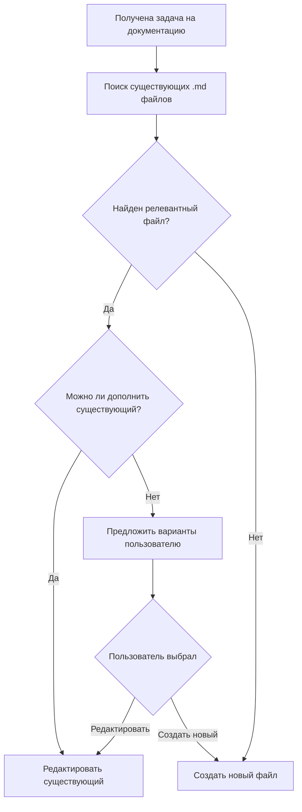

# Architect Workflow

## Обязательный pre-flight чеклист

Перед созданием любого нового `.md` файла architect ОБЯЗАН выполнить следующие шаги:

### 1. Поиск существующих файлов

```
list_files(path="docs", recursive=true)
```

Анализировать:
- Названия файлов на предмет релевантности теме
- Структуру директорий docs/
- Существующие разделы в файлах

### 2. Анализ соответствия

Для каждого найденного релевантного файла:
- Прочитать оглавление (headings)
- Оценить пересечение тематики
- Проверить возможность добавления нового раздела

### 3. Принятие решения

На основе анализа выбрать:
- **Редактировать существующий** — если тема пересекается
- **Создать новый** — только если тема принципиально новая
- **Предложить варианты пользователю** — если неочевидно

---

## Алгоритм принятия решения



**Текстовая версия:**

```
Получена задача на документацию
    ↓
Поиск существующих .md файлов
    ↓
Найден релевантный файл?
    ├─ Да → Можно ли дополнить существующий?
    │   ├─ Да → Редактировать существующий
    │   └─ Нет → Предложить пользователю варианты
    └─ Нет → Создать новый файл
```

---

## Критерии создания нового файла

Новый `.md` файл УМЕСТНО создавать только в следующих случаях:

### ✅ Принципиально новая тема

Тема не пересекается с существующими файлами:
- Нет релевантных файлов по названию
- Содержимое существующих файлов не затрагивает эту тему
- Пример: Создать `docs/testing/performance.md` для тестирования производительности (если ещё нет)

### ✅ Существующий файл стал слишком большим

Файл содержит более 300-400 строк и требует разделения:
- Логически связанные разделы группируются
- Создаётся новая директория для связанных тем
- Пример: Разделить `architecture.md` на `architecture/overview.md` и `architecture/components.md`

### ✅ Разный уровень абстракции

Информация относится к разным уровням детализации:
- Архитектурный уровень (высокий уровень) vs имплементация (детали)
- Обзор vs deep dive
- Пример: `architecture.md` (архитектура) и `api_reference.md` (детали API)

### ✅ Явный запрос пользователя

Пользователь прямо попросил создать новый файл:
- "Создай новый файл для описания X"
- "Мне нужен отдельный документ для Y"

---

## Критерии редактирования существующего файла

Существующий файл ОБЯЗАТЕЛЬНО редактировать в следующих случаях:

### ✅ Тема уже покрыта существующим файлом

Информация логически вписывается в существующую структуру:
- Добавление нового раздела
- Расширение существующего раздела
- Пример: Добавить раздел "Event Loop" в `architecture.md`

### ✅ Обновление устаревшей информации

Содержимое файла требует актуализации:
- Изменения в коде отражаются в документации
- Новые версии API
- Изменения в архитектуре

### ✅ Добавление информации в существующую структуру

Файл уже содержит структуру для этой темы:
- Секция "TODO" или "Planned"
- Неполный раздел, требующий дополнения
- Пример: Добавить описание нового метода в `api_reference.md`

---

## Примеры правильного и неправильного поведения

### ❌ Плохо

```bash
# Создание нового файла вместо редактирования существующего
architecture-v2.md
architecture-new.md
api-reference-new.md
api-reference-updated.md
```

**Почему плохо:**
- Дублирование информации
- Путаница — какая версия актуальная?
- Разброс документации
- Сложность навигации

### ✅ Хорошо

```bash
# Редактирование существующего файла
# Добавление раздела "Event Loop" в architecture.md
# Добавление описания метода в api_reference.md
```

**Почему хорошо:**
- Единый источник истины
- Логичная структура
- Простота навигации
- Актуальность информации

### Конкретные кейсы

| Ситуация | ❌ Плохо | ✅ Хорошо |
|----------|---------|-----------|
| Добавить описание Event Loop | Создать `architecture-event-loop.md` | Добавить раздел в `architecture.md` |
| Описать новый метод API | Создать `api-reference-new.md` | Добавить метод в `api_reference.md` |
| Документировать новый компонент | Создать `architecture-v2.md` | Создать `architecture/new-component.md` |
| Обновить устаревшую информацию | Создать `architecture-fixed.md` | Отредактировать `architecture.md` |

---

## Инструменты для поиска существующих файлов

### 1. Обзор структуры docs/

```bash
# Рекурсивный список всех файлов
list_files(path="docs", recursive=true)
```

**Что искать:**
- Файлы с похожими названиями
- Директории по теме
- Файлы в тематических подпапках

### 2. Поиск по ключевым словам

Анализировать названия файлов на наличие:
- Ключевых слов темы (architecture, api, testing, deployment)
- Синонимов и связанных терминов
- Аббревиатур и сокращений

**Пример:**
- Тема: "Event Loop"
- Ключевые слова: `architecture`, `events`, `loop`, `processing`
- Релевантные файлы: `architecture.md`, `event_dispatcher.md`

### 3. Чтение оглавления

Для найденных файлов прочитать структуру:

```bash
read_file(files=[{"path": "docs/architecture.md"}])
```

**Что анализировать:**
- Наличие релевантных разделов
- Возможность добавить новый раздел
- Логическую связность с темой

### 4. Проверка Memory Server

```python
mcp__memory__search_nodes(query="architecture documentation")
```

**Что искать:**
- Существующие сущности типа `file` в `docs/`
- Связи между документами
- Наблюдения о структуре документации

---

## Шпаргалка для architect

### Перед созданием нового файла

1. ✅ Выполнить `list_files(path="docs", recursive=true)`
2. ✅ Проанализировать найденные файлы
3. ✅ Прочитать оглавление релевантных файлов
4. ✅ Задать вопрос пользователю, если неочевидно

### При принятии решения

- Если есть релевантный файл → редактировать
- Если тема новая → создавать новый
- Если сомневаешься → спросить пользователя

### После создания файла

- ✅ Обновить оглавление в родительском файле (если нужно)
- ✅ Добавить ссылки в связанные документы
- ✅ Обновить Memory Server

---

## Связанные документы

- [`../../AGENTS.md`](../../AGENTS.md) — основные правила работы для всех агентов
- [`task-strategy.md`](task-strategy.md) — стратегия разбиения задач
- [`coding-standards.md`](coding-standards.md) — стандарты кодирования
- [`workflow.md`](workflow.md) — Git workflow
