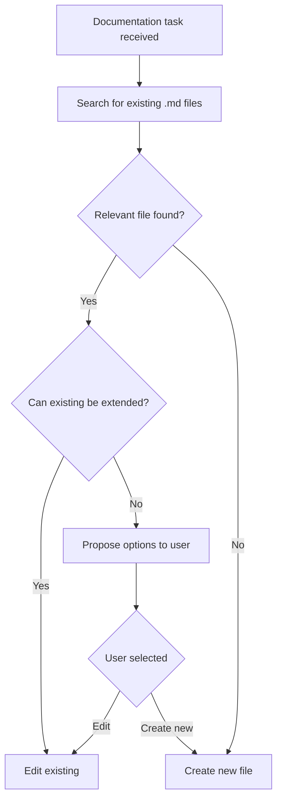

# Architect Workflow

## Mandatory Pre-Flight Checklist

Before creating any new `.md` file, the architect MUST complete the following steps:

### 1. Search for Existing Files

```
list_files(path="docs", recursive=true)
```

Analyze:
- File names for relevance to the topic
- Structure of the docs/ directory
- Existing sections in files

### 2. Analyze Relevance

For each relevant file found:
- Read the table of contents (headings)
- Evaluate topic overlap
- Check if a new section can be added

### 3. Make a Decision

Based on the analysis, choose:
- **Edit existing** — if the topic overlaps
- **Create new** — only if the topic is fundamentally different
- **Propose options to user** — if unclear

---

## Decision-Making Algorithm



**Text version:**

```
Documentation task received
    ↓
Search for existing .md files
    ↓
Relevant file found?
    ├─ Yes → Can existing be extended?
    │   ├─ Yes → Edit existing
    │   └─ No → Propose options to user
    └─ No → Create new file
```

---

## Criteria for Creating a New File

A new `.md` file is APPROPRIATE to create only in the following cases:

### ✅ Fundamentally New Topic

The topic does not overlap with existing files:
- No relevant files by name
- Existing file content does not cover this topic
- Example: Create `docs/testing/performance.md` for performance testing (if not already present)

### ✅ Existing File Became Too Large

File contains more than 300-400 lines and requires splitting:
- Logically related sections are grouped
- Create a new directory for related topics
- Example: Split `architecture.md` into `architecture/overview.md` and `architecture/components.md`

### ✅ Different Abstraction Level

Information relates to different detail levels:
- Architectural level (high level) vs implementation (details)
- Overview vs deep dive
- Example: `architecture.md` (architecture) and `api_reference.md` (API details)

### ✅ Explicit User Request

User explicitly requested to create a new file:
- "Create a new file to describe X"
- "I need a separate document for Y"

---

## Criteria for Editing Existing File

An existing file MUST be edited in the following cases:

### ✅ Topic Already Covered by Existing File

Information logically fits into existing structure:
- Adding a new section
- Extending an existing section
- Example: Add "Event Loop" section to `architecture.md`

### ✅ Updating Outdated Information

File content requires actualization:
- Code changes reflected in documentation
- New API versions
- Architecture changes

### ✅ Adding Information to Existing Structure

File already contains structure for this topic:
- "TODO" or "Planned" section
- Incomplete section requiring addition
- Example: Add description of a new method to `api_reference.md`

---

## Examples of Correct and Incorrect Behavior

### ❌ Bad

```bash
# Creating a new file instead of editing existing
architecture-v2.md
architecture-new.md
api-reference-new.md
api-reference-updated.md
```

**Why it's bad:**
- Information duplication
- Confusion — which version is current?
- Scattered documentation
- Difficult navigation

### ✅ Good

```bash
# Editing existing file
# Adding "Event Loop" section to architecture.md
# Adding method description to api_reference.md
```

**Why it's good:**
- Single source of truth
- Logical structure
- Easy navigation
- Current information

### Specific Cases

| Situation | ❌ Bad | ✅ Good |
|-----------|-------|---------|
| Add Event Loop description | Create `architecture-event-loop.md` | Add section to `architecture.md` |
| Describe new API method | Create `api-reference-new.md` | Add method to `api_reference.md` |
| Document new component | Create `architecture-v2.md` | Create `architecture/new-component.md` |
| Update outdated information | Create `architecture-fixed.md` | Edit `architecture.md` |

---

## Tools for Finding Existing Files

### 1. Review docs/ Structure

```bash
# Recursive list of all files
list_files(path="docs", recursive=true)
```

**What to look for:**
- Files with similar names
- Directories by topic
- Files in thematic subfolders

### 2. Keyword Search

Analyze file names for:
- Topic keywords (architecture, api, testing, deployment)
- Synonyms and related terms
- Abbreviations and shortenings

**Example:**
- Topic: "Event Loop"
- Keywords: `architecture`, `events`, `loop`, `processing`
- Relevant files: `architecture.md`, `event_dispatcher.md`

### 3. Read Table of Contents

For found files, read the structure:

```bash
read_file(files=[{"path": "docs/architecture.md"}])
```

**What to analyze:**
- Presence of relevant sections
- Possibility to add a new section
- Logical connection with the topic

### 4. Check Memory Server

```python
mcp__memory__search_nodes(query="architecture documentation")
```

**What to look for:**
- Existing entities of type `file` in `docs/`
- Links between documents
- Observations about documentation structure

---

## Architect Cheat Sheet

### Before Creating a New File

1. ✅ Execute `list_files(path="docs", recursive=true)`
2. ✅ Analyze found files
3. ✅ Read table of contents of relevant files
4. ✅ Ask user if unclear

### When Making a Decision

- If relevant file exists → edit
- If topic is new → create new
- If in doubt → ask user

### After Creating File

- ✅ Update table of contents in parent file (if needed)
- ✅ Add links in related documents
- ✅ Update Memory Server

---

## Related Documents

- [`../../AGENTS.md`](../../AGENTS.md) — general work rules for all agents
- [`task-strategy.md`](task-strategy.md) — task breakdown strategy
- [`coding-standards.md`](coding-standards.md) — coding standards
- [`workflow.md`](workflow.md) — Git workflow
