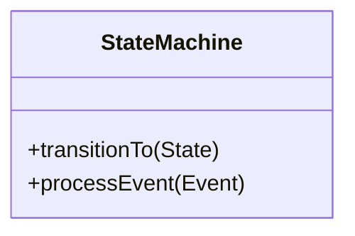
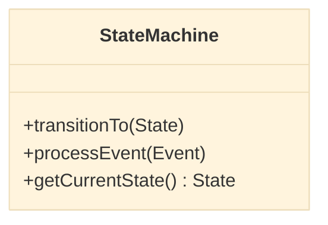
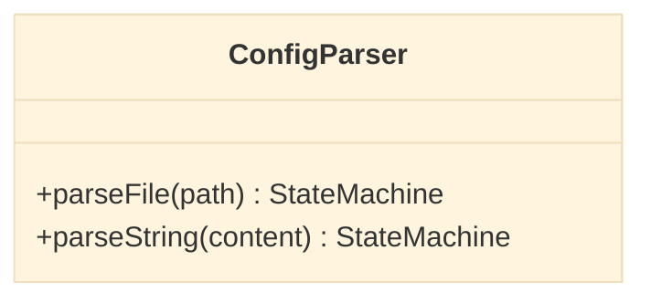
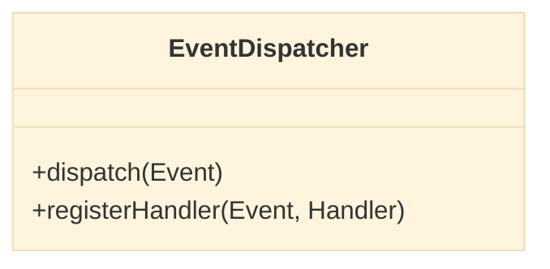
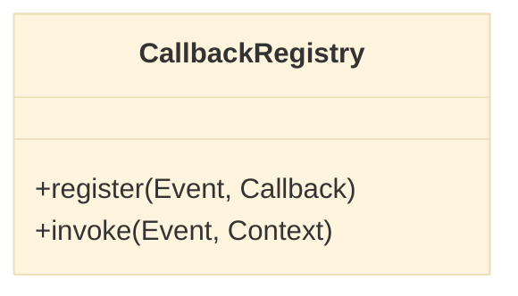
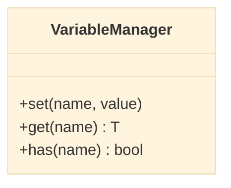
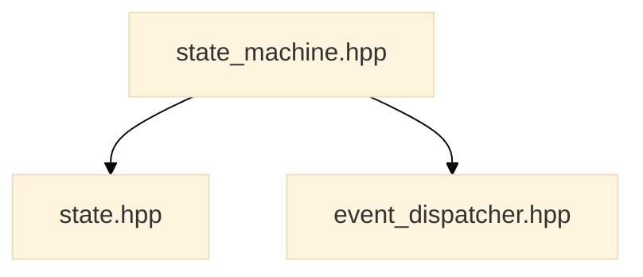

# UML Diagrams for FSMConfig

This document contains UML diagrams generated using [clang-uml](https://github.com/bkryza/clang-uml) for the FSMConfig library. The diagrams provide visual representations of the library's class structure, relationships, and include dependencies.

## Overview

The following UML diagrams have been generated for the FSMConfig library:

| Diagram | Description | File |
|---------|-------------|------|
| | **Main Class Diagram** | Overview of all FSMConfig classes and their relationships | [`fsmconfig_main_class.mmd`](diagrams/fsmconfig_main_class.mmd) |
| | **StateMachine Diagram** | Detailed view of the StateMachine class | [`fsmconfig_state_machine.mmd`](diagrams/fsmconfig_state_machine.mmd) |
| | **ConfigParser Diagram** | Detailed view of the ConfigParser class | [`fsmconfig_config_parser.mmd`](diagrams/fsmconfig_config_parser.mmd) |
| | **EventDispatcher Diagram** | Detailed view of the EventDispatcher class | [`fsmconfig_event_dispatcher.mmd`](diagrams/fsmconfig_event_dispatcher.mmd) |
| | **CallbackRegistry Diagram** | Detailed view of the CallbackRegistry class | [`fsmconfig_callback_registry.mmd`](diagrams/fsmconfig_callback_registry.mmd) |
| | **VariableManager Diagram** | Detailed view of the VariableManager class | [`fsmconfig_variable_manager.mmd`](diagrams/fsmconfig_variable_manager.mmd) |
| | **Include Diagram** | Header file inclusion dependencies | [`fsmconfig_include_diagram.mmd`](diagrams/fsmconfig_include_diagram.mmd) |

## Viewing the Diagrams

The diagrams are provided in [Mermaid](https://mermaid.js.org/) format (`.mmd` files). Mermaid is a markdown-like syntax for creating diagrams that can be rendered directly in many markdown viewers and tools.

### Online Viewers

- [Mermaid Live Editor](https://mermaid.live/)
- [Mermaid Chart](https://www.mermaidchart.com/)

Simply copy the contents of any `.mmd` file and paste it into the online viewer.

### GitHub Native Support

Mermaid diagrams are natively supported on GitHub! You can view them directly in:
- GitHub repository files (when rendered)
- GitHub Issues and Pull Requests
- GitHub Wikis
- GitHub README files

### Local Tools

To render the diagrams locally, you can use:

```bash
# Install mermaid-cli (requires Node.js)
npm install -g @mermaid-js/mermaid-cli

# Generate PNG from Mermaid file
mmdc -i docs/diagrams/fsmconfig_main_class.mmd -o output.png

# Generate SVG from Mermaid file
mmdc -i docs/diagrams/fsmconfig_main_class.mmd -o output.svg
```

### VS Code Extension

Install the [Mermaid Preview](https://marketplace.visualstudio.com/items?itemName=bierner.markdown-mermaid) extension for VS Code to preview diagrams directly in the editor.

### Using with Markdown

You can embed Mermaid diagrams directly in markdown files:

```markdown

```

## Important Notes About the Diagrams

**All diagrams show comprehensive relationships:**

- **Individual class diagrams** (e.g., `fsmconfig_state_machine.mmd`) include not just the main class but **all related classes and their relationships**. This provides a complete view of how each component interacts with the rest of the system.
- **Main class diagram** (`fsmconfig_main_class.mmd`) shows all classes together and is the best starting point for understanding the overall architecture.
- **STL types are included** in the diagrams (std::string, std::map, std::vector, std::unique_ptr, etc.) to provide complete type information.
- **Relationship types shown:**
  - **Composition** (filled diamond): "owns" relationship, lifecycle dependency
  - **Aggregation** (empty diamond): "has" relationship, no lifecycle dependency
  - **Association** (solid line): "uses" relationship
  - **Dependency** (dashed line): "depends on" relationship

**Recommendation:** Start with the main class diagram to understand the overall architecture, then explore individual class diagrams for deeper details about specific components.

## Diagram Descriptions

### Main Class Diagram

```mermaid
%%{init: {'theme':'base'}}%%
classDiagram
    %% See full diagram in: diagrams/fsmconfig_main_class.mmd
    classDiagram
        class StateMachine {
            +transitionTo(State)
            +processEvent(Event)
        }
        class State {
            +getName()
            +onEnter()
            +onExit()
        }
        StateMachine "1" --> "*" State : contains
```

The main class diagram provides a high-level overview of all FSMConfig classes and their relationships. It shows:

- All major classes in the `fsmconfig` namespace
- Inheritance relationships
- Composition and aggregation relationships
- Key methods and attributes

**Key insights:**
- [`StateMachine`](../include/fsmconfig/state_machine.hpp) is the central class that orchestrates the FSM functionality
- [`State`](../include/fsmconfig/state.hpp) represents individual states in the machine
- [`ConfigParser`](../include/fsmconfig/config_parser.hpp) handles YAML configuration parsing
- [`EventDispatcher`](../include/fsmconfig/event_dispatcher.hpp) manages event processing
- [`CallbackRegistry`](../include/fsmconfig/callback_registry.hpp) provides callback registration and invocation
- [`VariableManager`](../include/fsmconfig/variable_manager.hpp) manages state variables

### StateMachine Class Diagram



Detailed view of the [`StateMachine`](../include/fsmconfig/state_machine.hpp) class showing:

- Public API methods for state transitions and event handling
- Private implementation details
- Relationships with other FSMConfig classes
- Method signatures and return types

### ConfigParser Class Diagram



Detailed view of the [`ConfigParser`](../include/fsmconfig/config_parser.hpp) class showing:

- YAML parsing methods
- Configuration validation logic
- Error handling mechanisms
- Integration with yaml-cpp library

### EventDispatcher Class Diagram



Detailed view of the [`EventDispatcher`](../include/fsmconfig/event_dispatcher.hpp) class showing:

- Event queue management
- Event processing logic
- Thread-safety considerations
- Integration with StateMachine

### CallbackRegistry Class Diagram



Detailed view of the [`CallbackRegistry`](../include/fsmconfig/callback_registry.hpp) class showing:

- Callback registration methods
- Event-to-callback mapping
- Callback invocation mechanisms
- Support for different callback types

### VariableManager Class Diagram



Detailed view of the [`VariableManager`](../include/fsmconfig/variable_manager.hpp) class showing:

- Variable storage and retrieval
- Type-safe variable access
- Variable scoping rules
- Integration with state transitions

### Include Diagram



The include diagram shows header file dependencies within the FSMConfig library:

- Which headers include other headers
- Circular dependencies (if any)
- Public API headers vs. implementation headers
- Overall module structure

## Regenerating Diagrams

The UML diagrams are automatically generated using clang-uml. To regenerate them:

### Using the CMake Target

```bash
# Build the project first
cd build
cmake .. -DCMAKE_BUILD_TYPE=Release -DCMAKE_EXPORT_COMPILE_COMMANDS=ON
cmake --build .

# Generate UML diagrams (Mermaid format)
make uml-diagrams
# or
cmake --build . --target uml-diagrams
```

### Manual Generation

```bash
# From the project root
clang-uml --config .clang-uml -g mermaid
```

## Configuration

The clang-uml configuration is defined in [`.clang-uml`](../.clang-uml) at the project root. Key settings:

- **Compilation database**: `build/compile_commands.json`
- **Output directory**: `docs/diagrams/`
- **Output format**: Mermaid (`.mmd` files)
- **Diagram types**: Class diagrams and include diagrams
- **Namespace filtering**: `fsmconfig` namespace only

## Integration with Documentation

These UML diagrams complement the existing FSMConfig documentation:

- [`architecture.md`](architecture.md) - High-level architecture overview
- [`api_reference.md`](api_reference.md) - Detailed API documentation
- [`examples.md`](examples.md) - Usage examples

## Notes

- Diagrams are generated from the actual source code, ensuring they stay in sync with the implementation
- The Mermaid source files are version-controlled, allowing for easy tracking of changes
- Mermaid format was chosen for better integration with markdown and GitHub
- Diagrams can be viewed directly on GitHub without any additional tools
- Diagram regeneration is automated via CMake targets for consistency
- For the most up-to-date diagrams, regenerate after any significant code changes

## Advantages of Mermaid Format

- **Native GitHub support**: No need for external tools to view diagrams on GitHub
- **Markdown integration**: Can be embedded directly in markdown files
- **Text-based**: Easy to version control and review changes
- **Widely supported**: Rendered by many markdown viewers and documentation tools
- **Easy to edit**: Simple syntax that's easy to learn and modify

## Further Reading

- [clang-uml Documentation](https://github.com/bkryza/clang-uml)
- [Mermaid Documentation](https://mermaid.js.org/intro/)
- [Mermaid Class Diagram Syntax](https://mermaid.js.org/syntax/classDiagram.html)
- [UML Class Diagrams](https://www.uml-diagrams.org/class-diagrams.html)
